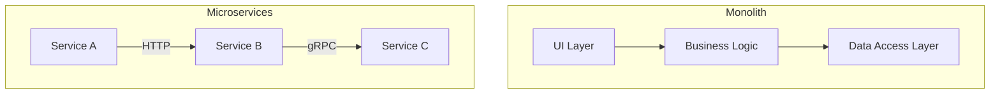

# 📘 Distributed Systems & Cloud Native Architecture

## 1. Architectural Patterns

### 1.1 Monolithic Architecture
A software architecture where the functional process is composed of a single unit.
*   **Characteristics**: Single codebase, single build artifact, shared database.
*   **Tight Coupling**: Components are directly dependent on each other. A failure in one module (e.g., memory leak in Reporting) can crash the entire process.
*   **Scaling Limitations**: Vertical scaling (adding CPU/RAM) is the primary method. Horizontal scaling requires replicating the entire monolith, which is resource-inefficient.

### 1.2 Microservices Architecture
An architectural style that structures an application as a collection of services that are:
*   **Loosely Coupled**: Services communicate via network protocols (HTTP/gRPC) rather than in-memory calls.
*   **Independently Deployable**: A change in the *Payment Service* does not require redeploying the *User Service*.
*   **Polyglot**: Services can be written in different languages and use different storage technologies suited to their specific domain.

## 2. Cloud Native Principles

### 2.1 Definition (CNCF)
Cloud native technologies empower organizations to build and run scalable applications in modern, dynamic environments such as public, private, and hybrid clouds. Key pillars include:

1.  **Containerization**: Packaging code and dependencies together (Docker).
2.  **Orchestration**: Managing the lifecycle of containers (Kubernetes).
3.  **Microservices**: Modular architecture.
4.  **Immutable Infrastructure**: Servers are never modified after deployment. If an update is needed, the server/container is replaced, not patched.

### 2.2 The 12-Factor App Methodology
A set of best practices for building Software-as-a-Service (SaaS) applications.
1.  **Codebase**: One codebase tracked in revision control, many deploys.
2.  **Dependencies**: Explicitly declare and isolate dependencies.
3.  **Config**: Store configuration in the environment (not code).
4.  **Backing Services**: Treat backing services (DB, Queue) as attached resources.
5.  **Build, Release, Run**: Strictly separate build and run stages.
6.  **Processes**: Execute the app as one or more stateless processes.
7.  **Port Binding**: Export services via port binding.
8.  **Concurrency**: Scale out via the process model.
9.  **Disposability**: Maximize robustness with fast startup and graceful shutdown.
10. **Dev/Prod Parity**: Keep development, staging, and production as similar as possible.
11. **Logs**: Treat logs as event streams.
12. **Admin Processes**: Run admin/management tasks as one-off processes.

## 3. Infrastructure Management

### 3.1 Immutable Infrastructure ("Pets vs Cattle")
*   **Mutable (Pets)**: Servers are patched and updated in place. Leads to "Configuration Drift" where servers become unique snowflakes, making debugging impossible.
*   **Immutable (Cattle)**: Infrastructure is replaced for every deployment. This guarantees consistency and enables reliable rollback strategies.

### 3.2 GitOps & Infrastructure as Code (IaC)
*   **Declarative Specification**: You define *what* you want (e.g., "3 replicas of Nginx"), not *how* to get there.
*   **Single Source of Truth**: The desired state of the system is version-controlled in Git.
*   **Reconciliation**: Automated agents (like ArgoCD or Kubernetes Controllers) continuously monitor the live system and apply changes to match the Git state.

## 4. Distributed Systems Theory

### 4.1 CAP Theorem
In a distributed data store, it is impossible to simultaneously provide more than two out of the following three guarantees:
1.  **Consistency (C)**: Every read receives the most recent write or an error.
2.  **Availability (A)**: Every request receives a (non-error) response, without the guarantee that it contains the most recent write.
3.  **Partition Tolerance (P)**: The system continues to operate despite an arbitrary number of messages being dropped or delayed by the network.

*   **Kubernetes Context**: Kubernetes (via **etcd**) is a **CP** system. It prioritizes Consistency and Partition Tolerance. If the network partitions, the cluster may stop accepting writes to ensure data doesn't diverge.

### 4.2 Scaling Paradigms
*   **Vertical Scaling (Scale Up)**: Adding resources (CPU, RAM) to a single node. Limited by hardware maximums.
*   **Horizontal Scaling (Scale Out)**: Adding more nodes to the system. Theoretically infinite, but requires software to be designed for distribution (statelessness).

### 4.3 Service Discovery
In dynamic environments (like K8s), IP addresses change frequently. Service Discovery is the mechanism to locate a service instance.
*   **Client-Side**: The client queries a registry (e.g., Netflix Eureka) to find an IP.
*   **Server-Side**: The client calls a Load Balancer (e.g., K8s Service), which routes traffic to a healthy instance.
