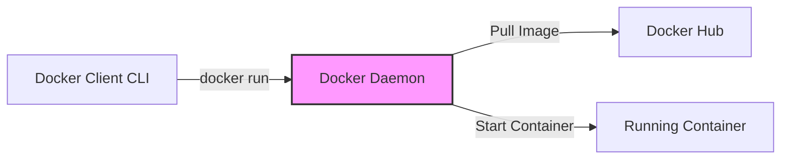
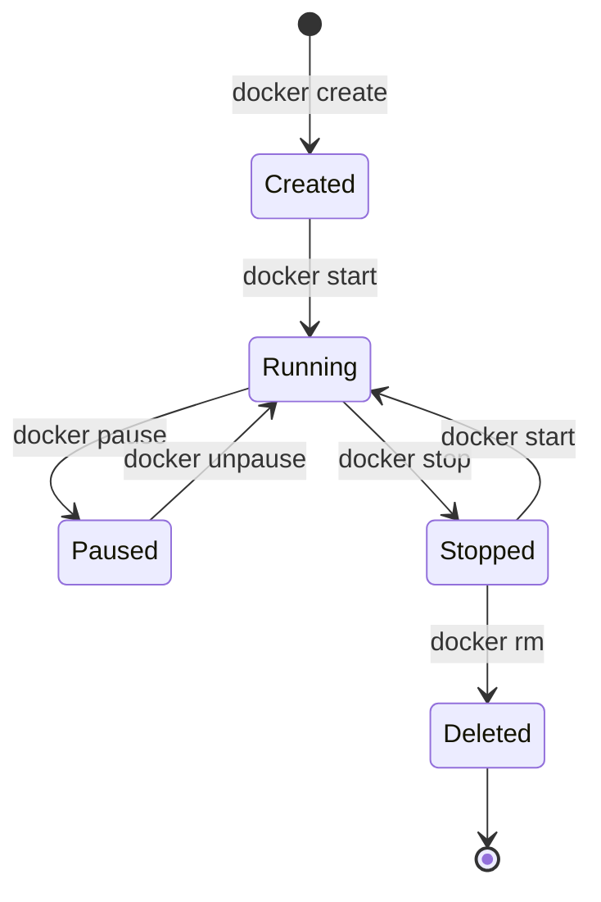
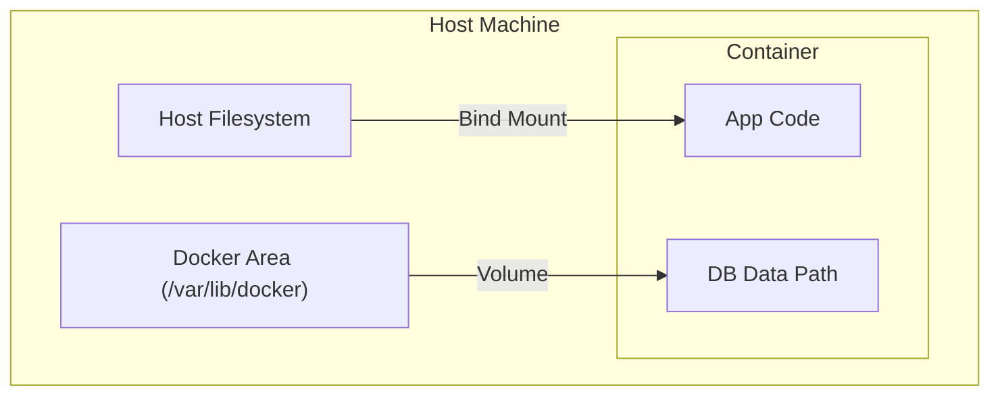

# 🐳 Docker: The Containerization Module
### *From Basics to Advanced Architecture*

## 1. What is a Container? (The "Why")
Before Docker, if you wanted to run an app, you had to install Python, dependencies, and libraries directly on your server.
*   **The Problem**: "It works on my machine!" (But fails in production because of a different Python version).
*   **The Solution**: A Container packages the code *and* the environment (OS, libraries, config) into a single artifact.

### 🆚 VM vs. Container
*   **Virtual Machine (VM)**: Virtualizes the **Hardware**. Each VM has a full OS kernel. Heavy (GBs), slow to boot (minutes).
*   **Container**: Virtualizes the **OS**. Shares the host's Linux Kernel. Lightweight (MBs), instant boot (milliseconds).

## 2. Core Concepts: The "Recipe vs Cake" Analogy

### 🖼️ Image (The Recipe)
An **Image** is a read-only template. It contains the instructions to create a container.
*   It's like a **Class** in OOP or a **Recipe** in cooking.
*   It is built from layers (Base OS -> Add Python -> Add Code).

### 📦 Container (The Cake)
A **Container** is a runnable instance of an image.
*   It's like an **Object** in OOP or the **Cake** you actually bake.
*   You can bake 100 cakes (containers) from 1 recipe (image).
*   If you destroy a container, the image remains untouched.

## 3. Docker Architecture
Docker uses a Client-Server architecture.

*   **Docker Daemon (`dockerd`)**: The "Brain". It runs in the background, managing all containers on the host.
*   **Docker Client (`docker`)**: The "Remote". When you type `docker run`, it sends an API request to the Daemon.
*   **Registry**: The "Library". A place to store images (e.g., Docker Hub).

## 4. The Container Lifecycle
Understanding the state of a container is crucial for debugging.

1.  **Created**: The container is created but not started.
2.  **Running**: The process is active.
3.  **Paused**: The process is frozen (SIGSTOP).
4.  **Stopped**: The process has exited (SIGTERM/SIGKILL).
5.  **Deleted**: The container is removed from disk.

## 5. Data Persistence (Volumes)
By default, containers are **ephemeral**. If you delete a container, its filesystem is destroyed.
*   **Problem**: If your Database container dies, you lose all your user data.
*   **Solution**: **Volumes**.

### Types of Storage
1.  **Bind Mounts**: Maps a file/folder from your *Host Machine* into the container.
    *   *Analogy*: Opening a window between your laptop and the container.
    *   *Use Case*: Live code reloading during development.
    *   *Flag*: `-v /path/on/host:/path/in/container`
2.  **Volumes**: Managed entirely by Docker. Stored in a special area of the host filesystem.
    *   *Analogy*: A secure vault managed by the Docker Daemon.
    *   *Use Case*: Database storage, persistent data.
    *   *Flag*: `-v volume_name:/path/in/container`

## 6. Networking
How do containers talk to each other?

*   **Bridge (Default)**: Think of this as a "Home Router" inside your computer. Containers on the same bridge can talk to each other, but are hidden from the outside world.
*   **Host**: The container shares the host's networking namespace. It's like plugging the container directly into the wall socket. Fast, but insecure.
*   **None**: No networking. The container is isolated.

## 7. Docker Compose
A tool for defining and running multi-container Docker applications.
Instead of running 5 separate `docker run` commands, you write one `docker-compose.yaml` file.
*   **Services**: The containers to run (e.g., `frontend`, `backend`, `db`).
*   **Networks**: How they talk.
*   **Volumes**: Where they store data.

## 🎓 The Master Command Reference

### 🏗️ Build & Manage Images
| Command | Description |
| :--- | :--- |
| `docker build -t app:v1 .` | Build an image from Dockerfile in current dir. |
| `docker images` | List all local images. |
| `docker rmi <image_id>` | Delete an image. |
| `docker history <image_id>` | See the layers that make up an image. |
| `docker prune -a` | Delete all unused images (DANGEROUS). |

### 🏃 Run & Manage Containers
| Command | Description |
| :--- | :--- |
| `docker run -d -p 80:80 --name web app:v1` | Run detached (-d), map port (-p), name it (--name). |
| `docker ps -a` | List all containers (running and stopped). |
| `docker stop <name>` | Gracefully stop (SIGTERM). |
| `docker kill <name>` | Force stop (SIGKILL). |
| `docker rm <name>` | Remove a stopped container. |
| `docker rm -f <name>` | Force remove a running container. |

### 🕵️ Debugging & Inspection
| Command | Description |
| :--- | :--- |
| `docker logs -f <name>` | Follow (-f) the stdout/stderr logs. |
| `docker exec -it <name> /bin/bash` | Interactive shell inside the container. |
| `docker inspect <name>` | View detailed JSON metadata (IP, Volumes, Env). |
| `docker stats` | Live stream of CPU/RAM usage for all containers. |

### 🕸️ Networking & Volumes
| Command | Description |
| :--- | :--- |
| `docker network ls` | List networks. |
| `docker network create my-net` | Create a custom bridge network. |
| `docker volume create my-vol` | Create a named volume. |
| `docker volume inspect my-vol` | Find where the volume lives on disk. |

### 🐙 Docker Compose
| Command | Description |
| :--- | :--- |
| `docker-compose up -d` | Start all services in background. |
| `docker-compose down` | Stop and remove containers and networks. |
| `docker-compose logs -f` | Follow logs of all services. |
| `docker-compose build` | Rebuild services. |
