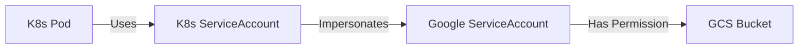

# The Ultimate Guide to Google Cloud Platform (GCP) for Kubernetes

## 1. Introduction to GCP
Google Cloud Platform (GCP) is a suite of cloud computing services that runs on the same infrastructure that Google uses internally. It is particularly known for its Kubernetes support, as Kubernetes was originally designed by Google.

---

## 2. GKE Architecture: How it Works

### 🏗️ The Control Plane & Nodes
In GKE, Google manages the Control Plane (Masters) for you. You only see the Worker Nodes.

```mermaid
graph TD
    subgraph "Google Managed Zone"
        CP[Control Plane (API Server, Scheduler)]
    end
    
    subgraph "Your VPC Network"
        subgraph "Zone A"
            Node1[Worker Node 1]
            Node2[Worker Node 2]
        end
        
        subgraph "Zone B"
            Node3[Worker Node 3]
        end
    end
    
    CP -- "Manages" --> Node1
    CP -- "Manages" --> Node2
    CP -- "Manages" --> Node3
    
    style CP fill:#4285F4,color:white
```

---

## 3. GKE Networking Deep Dive (VPC-Native)

### 🌐 The IP Address Problem
In traditional networking, Pods are hidden behind the Node's IP. In **VPC-Native** clusters (the default now), Pods get real VPC IP addresses.

```mermaid
graph TD
    subgraph "VPC Subnet (10.0.0.0/16)"
        RangeNodes[Primary Range: Nodes (10.0.1.0/24)]
        RangePods[Secondary Range: Pods (10.1.0.0/16)]
        RangeSvcs[Secondary Range: Services (10.2.0.0/20)]
    end
    
    Node1[Node VM] -->|IP: 10.0.1.5| RangeNodes
    Pod1[Pod A] -->|IP: 10.1.0.55| RangePods
    
    Node1 -- "Contains" --> Pod1
```

*   **Benefit**: A VM in the same VPC (e.g., a Jenkins server) can talk directly to `10.1.0.55` (the Pod) without needing a Load Balancer or Proxy.

---

## 4. How to Analyze Output: gcloud Commands

### Listing Clusters
```bash
gcloud container clusters list
```

**Output:**
```text
NAME              LOCATION       MASTER_VERSION   MASTER_IP       MACHINE_TYPE  NODE_VERSION     NUM_NODES  STATUS
ai-agent-cluster  us-central1    1.27.3-gke.100   34.123.45.67    e2-medium     1.27.3-gke.100   3          RUNNING
```
*   **MASTER_IP**: The public endpoint of your API server. This is what `kubectl` talks to.
*   **STATUS**: `RUNNING` is good. `PROVISIONING` means it's still creating. `RECONCILING` means it's updating.

### Getting Credentials
To connect `kubectl` to this cluster:
```bash
gcloud container clusters get-credentials ai-agent-cluster --region us-central1
```
*   **What this does**: It edits your `~/.kube/config` file. It adds a new "Context" and sets it as the current one.

---

## 5. Identity and Access Management (IAM)

### 🛡️ Workload Identity
The modern, secure way to let GKE Pods access GCP services (like reading from a GCS bucket).



1.  **Create GSA**: Create a Google Service Account (`my-app-sa@project.iam.gserviceaccount.com`).
2.  **Grant Roles**: Give that GSA permission (e.g., `roles/storage.objectViewer`).
3.  **Bind**: Tell GCP "The Kubernetes SA `my-app` in namespace `default` is allowed to act as `my-app-sa`".
4.  **Annotate**: Tell K8s "This KSA maps to that GSA".

---

## 6. Cost Optimization Tips
1.  **Spot VMs (Preemptible)**: Use Spot instances for stateless workloads (like batch jobs or stateless web apps). They are up to 91% cheaper but can be reclaimed by Google at any time.
2.  **Cluster Autoscaler**: Automatically adds nodes when pods are pending and removes nodes when they are underutilized.
3.  **Horizontal Pod Autoscaler (HPA)**: Scales the number of Pods based on CPU/Memory usage.
