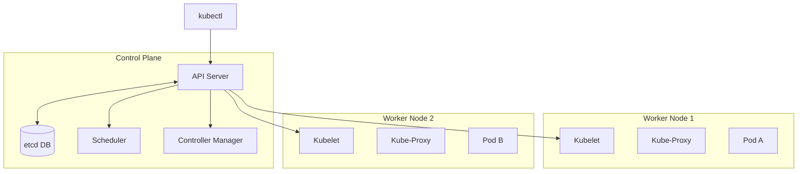
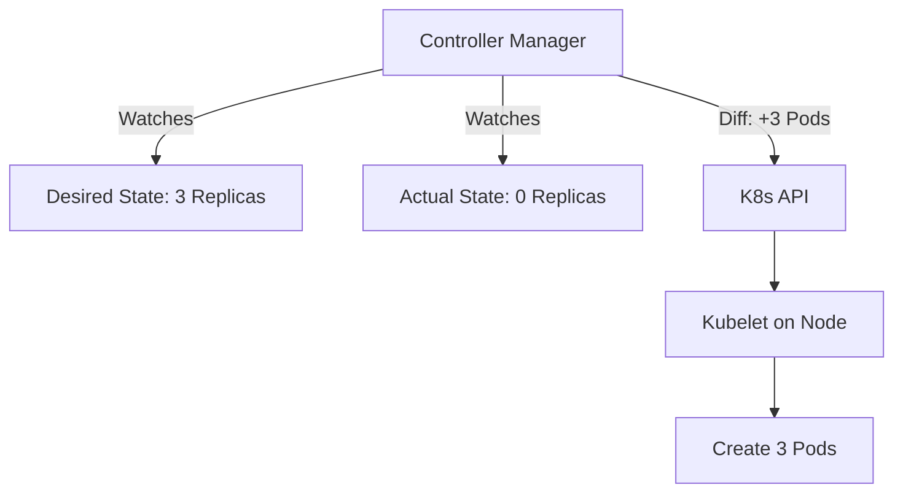

# ☸️ Kubernetes: The Orchestration Module
### *Deep Dive into K8s Objects, Architecture, and Operations*

## 1. What is Kubernetes? (The "Why" & "When")
Kubernetes (K8s) is an open-source system for automating deployment, scaling, and management of containerized applications.

### 🚦 When should you use it?
*   **✅ USE IT IF**:
    *   You have **Microservices**: Many small apps talking to each other.
    *   You need **High Availability**: If a server dies, the app must move to another one instantly.
    *   You need **Scaling**: Traffic spikes? Add 50 more copies of the app automatically.
*   **❌ AVOID IT IF**:
    *   You have a **Monolith**: A single giant app. (Just use a VM or Docker Compose).
    *   You have a **Small Team**: The complexity overhead is high.
    *   You have **Simple Needs**: A static website or a simple blog.

---

## 2. Under the Hood: Kubernetes Architecture
What actually runs on the servers? K8s is a cluster of computers (Nodes).

### 🧠 The Control Plane (The Brain)
Usually runs on a dedicated "Master Node".
1.  **API Server (`kube-apiserver`)**: The Front Door. Every command (`kubectl`) goes here. It validates requests.
2.  **etcd**: The Memory. A highly available key-value store. It saves the *entire state* of the cluster.
3.  **Scheduler (`kube-scheduler`)**: The Planner. It sees a new Pod and decides *which Node* has enough RAM/CPU to run it.
4.  **Controller Manager (`kube-controller-manager`)**: The Enforcer. It runs loops to ensure the *Actual State* matches the *Desired State* (e.g., "Are there 3 Nginx pods running? No? Start one.").

### 👷 The Worker Nodes (The Muscle)
Where your applications actually run.
1.  **Kubelet**: The Captain. An agent that talks to the API Server. It says "Okay, I'll start this Pod" and reports back "Pod is running".
2.  **Kube-Proxy**: The Networker. Maintains network rules so traffic can find the Pods.
3.  **Container Runtime**: The Engine. Docker, containerd, or CRI-O. It actually runs the containers.

---

## 3. System Requirements & Drawbacks

### 💻 Minimum System Requirements (Linux Server)
To run a production-grade cluster (not Minikube):
*   **CPU**: 2 Cores (Master), 1 Core (Worker).
*   **RAM**: 2GB (Master), 1GB (Worker).
*   **OS**: Linux (Ubuntu/CentOS/RHEL).
*   **Network**: Full connectivity between all machines.
*   **Swap**: **MUST BE DISABLED**. Kubelet fails if swap is on.

### ⚠️ Drawbacks & Challenges
1.  **Complexity**: The learning curve is steep. Networking, storage, and security are hard.
2.  **Overhead**: The Control Plane itself consumes resources. Running K8s for a single 50MB app is wasteful.
3.  **Day 2 Operations**: Upgrading a cluster without downtime is difficult. Debugging networking issues (DNS, CNI) can be a nightmare.

---

## 4. The Core Philosophy: The Control Loop
Kubernetes is **Declarative**. You define the *result*, not the steps.

*   **Imperative (Procedural)**: "Make a sandwich. Take bread. Add cheese. Add ham."
*   **Declarative (K8s)**: "I want a sandwich with cheese and ham." (K8s figures out how to make it).

---

## 5. Key Objects Explained

### 🥜 The "Pod" (The Atom)
*   **Definition**: The smallest deployable unit. A wrapper around one or more containers.
*   **Why?**: Containers in a Pod share **IP** and **Localhost**. They are "Peas in a Pod".

### 🚀 Workload Controllers
*   **Deployment**: For stateless apps (Web Servers). "I want 3 copies."
*   **StatefulSet**: For databases. "I want Pod-0, Pod-1, Pod-2 with persistent disks."
*   **DaemonSet**: For logs/monitoring. "Run one copy on *every* node."
*   **Job / CronJob**: For batch tasks. "Run this script once and stop."

### 📞 Services (Networking)
*   **ClusterIP**: Internal IP. Only accessible inside the cluster.
*   **NodePort**: Opens a port on the Node's IP (e.g., 30007).
*   **LoadBalancer**: Asks the Cloud Provider (AWS/GCP) for a real Public IP.

---

## 6. Storage Architecture
*   **PersistentVolume (PV)**: The physical hard drive (NFS, AWS EBS, GCE Disk).
*   **PersistentVolumeClaim (PVC)**: The request ticket. "I need 10GB".
*   **StorageClass**: The dynamic provisioner. It automatically creates the PV when you make a PVC.

---

## 🎓 The Master Command Reference

### 🔍 Context & Config
| Command | Description |
| :--- | :--- |
| `kubectl config get-contexts` | List available clusters. |
| `kubectl config use-context <name>` | Switch active cluster. |

### 📦 Pods & Debugging
| Command | Description |
| :--- | :--- |
| `kubectl get pods -o wide` | Show IP and Node info. |
| `kubectl logs <pod> -c <container>` | Get logs of specific container. |
| `kubectl port-forward <pod> 8080:80` | Access pod locally. |
| `kubectl describe pod <name>` | **Crucial**: Shows events (Why is it crashing?). |

### 🛠️ Creating & Editing
| Command | Description |
| :--- | :--- |
| `kubectl apply -f file.yaml` | Create/Update resources. |
| `kubectl delete -f file.yaml` | Delete resources. |
| `kubectl scale deployment web --replicas=5` | Scale up manually. |

### 🧠 Advanced JSONPath
| Command | Description |
| :--- | :--- |
| `kubectl get nodes -o jsonpath='{.items[*].status.addresses[?(@.type=="ExternalIP")].address}'` | Get all external IPs. |
