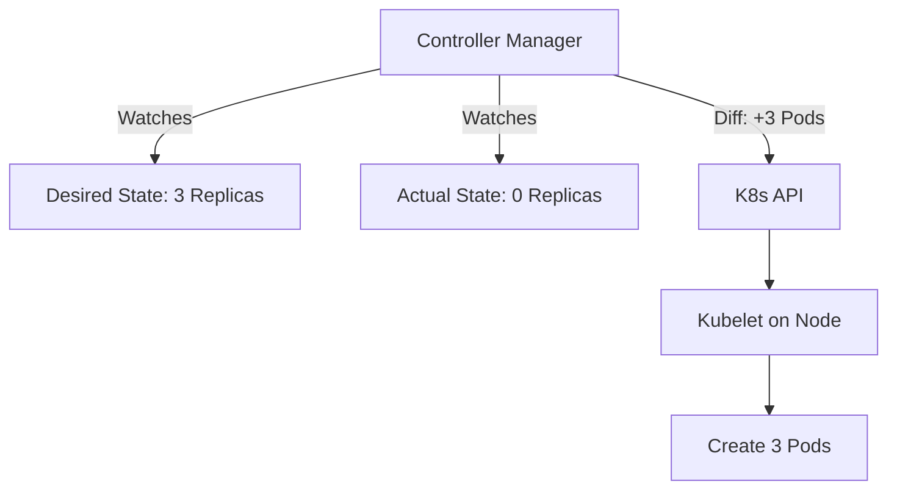
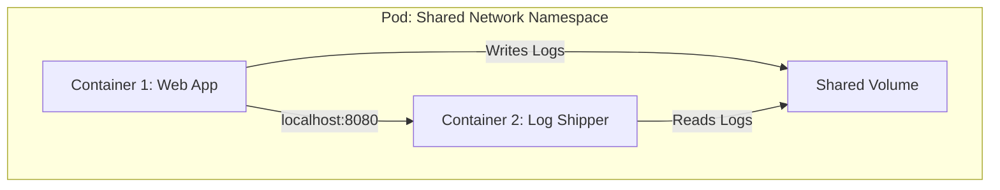
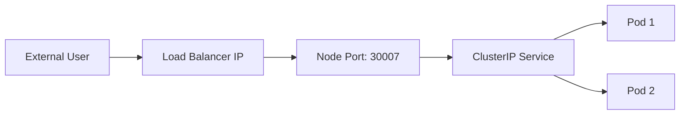

# ☸️ Kubernetes: The Orchestration Module
### *Deep Dive into K8s Objects and Operations*

## 1. The Core Philosophy: The Control Loop
Kubernetes is not a procedural system (do A, then B). It is a **Declarative System**.
*   **The Thermostat Analogy**:
    *   You set the thermostat to 72°F (Desired State).
    *   The room is 68°F (Actual State).
    *   The thermostat turns on the heater (Reconciliation Loop) until 68°F becomes 72°F.
*   **In Kubernetes**:
    *   You say: "I want 3 replicas of Nginx".
    *   K8s sees 0 replicas.
    *   K8s creates 3 pods to match your desire.

## 2. The "Pod" (The Atom)
Why not just run containers? Why do we need Pods?
*   **Definition**: A Pod is a wrapper around one or more containers. It is the smallest deployable unit in K8s.
*   **The "Peas in a Pod" Analogy**: Sometimes you need two containers to work tightly together (e.g., a Web Server and a Log Shipper).
    *   They share the same **IP Address**.
    *   They share the same **Localhost** (they can talk via `localhost:8080`).
    *   They share **Volumes**.

## 3. Workload Resources (The Managers)
You rarely create Pods directly. You use "Controllers" to manage them.

### 🚀 Deployment (Stateless)
*   **Analogy**: The "Manager". You tell the Manager "I want 3 workers". The Manager ensures 3 workers are always present. If one gets sick (crashes), the Manager hires a new one immediately.
*   **Use Case**: Web Servers, APIs (where any pod is interchangeable).

### 💾 StatefulSet (Stateful)
*   **Analogy**: Named Seats. "Worker 1" must sit in "Seat 1". If "Worker 1" leaves, the new guy *must* take "Seat 1" and inherit "Worker 1's" computer (disk).
*   **Use Case**: Databases (Redis, Postgres). They need stable identities (`db-0`, `db-1`) and persistent storage.

### 👻 DaemonSet
*   **Analogy**: The "Building Maintenance". You need one maintenance worker on *every single floor* (Node) of the building.
*   **Use Case**: Log Collectors, Monitoring Agents.

## 4. Services (The Receptionist)
Pods are mortal. They die and get new IPs. How do clients find them?
*   **The Problem**: You can't call a Pod by IP because the IP changes.
*   **The Solution**: A **Service**.
*   **Analogy**: A Company Receptionist. You don't call "Bob at Desk 42". You call the "Support Line" (Service). The Receptionist forwards your call to *any* available support agent (Pod).

### Types of Services
1.  **ClusterIP (Internal)**: Only people *inside* the office (Cluster) can call this number.
2.  **NodePort (External-ish)**: A hole in the wall. You can access it via `NodeIP:Port`.
3.  **LoadBalancer (External)**: A public phone number. AWS/GCP gives you a real IP.

## 5. Storage Architecture
*   **PersistentVolume (PV)**: The actual hard drive (The Hardware).
*   **PersistentVolumeClaim (PVC)**: The ticket/request (The Software). "I claim 10GB of space".
*   **StorageClass**: The menu. "Gold" (SSD), "Silver" (HDD).

## 🎓 The Master Command Reference

### 🔍 Context & Config
| Command | Description |
| :--- | :--- |
| `kubectl config get-contexts` | List available clusters. |
| `kubectl config use-context <name>` | Switch active cluster. |
| `kubectl config set-context --current --namespace=dev` | Set default namespace to 'dev'. |

### 📦 Pods & Debugging
| Command | Description |
| :--- | :--- |
| `kubectl get pods -o wide` | Show extra info (IP, Node). |
| `kubectl get pods --show-labels` | Show labels attached to pods. |
| `kubectl logs <pod> -c <container>` | Get logs of specific container in multi-container pod. |
| `kubectl logs <pod> --previous` | Get logs of the *crashed* instance. |
| `kubectl port-forward <pod> 8080:80` | Forward local port 8080 to pod port 80. |
| `kubectl top pod` | Show CPU/Memory usage (requires metrics-server). |

### 🛠️ Creating & Editing
| Command | Description |
| :--- | :--- |
| `kubectl create deployment web --image=nginx` | Quick deployment creation. |
| `kubectl expose deployment web --port=80` | Create a Service for a deployment. |
| `kubectl edit deployment web` | Open the YAML in default editor (Vi/Nano). |
| `kubectl scale deployment web --replicas=0` | Quick way to kill all pods. |

### 🧹 Housekeeping
| Command | Description |
| :--- | :--- |
| `kubectl delete pod <name> --grace-period=0 --force` | Force delete a stuck pod. |
| `kubectl api-resources` | List all available resource types in the cluster. |
| `kubectl explain deployment.spec` | Built-in documentation for YAML fields. |

### 🧠 Advanced JSONPath Tricks
| Command | Description |
| :--- | :--- |
| `kubectl get nodes -o jsonpath='{.items[*].status.addresses[?(@.type=="ExternalIP")].address}'` | Get all external IPs. |
| `kubectl get pods --sort-by='.status.startTime'` | List pods sorted by age. |
