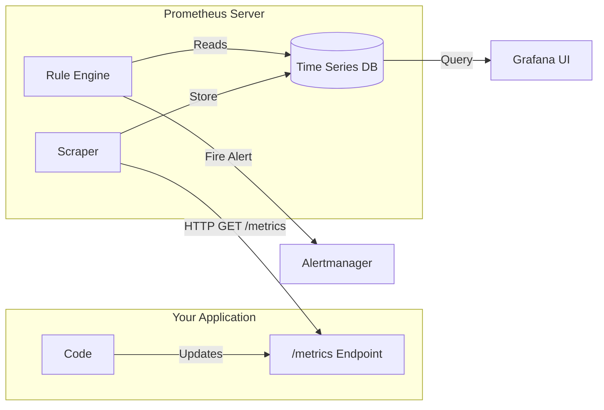

# The Ultimate Guide to Observability: Prometheus & Grafana

## 1. What is Observability?
Observability is the ability to understand the internal state of a system by examining its outputs. In Kubernetes, this typically involves three pillars:
1.  **Metrics**: "What is happening?" (e.g., CPU usage is 80%).
2.  **Logs**: "Why is it happening?" (e.g., Error: Connection refused).
3.  **Traces**: "Where is it happening?" (e.g., Latency in the payment-service).

---

## 2. Prometheus Architecture: The Pull Model

Prometheus is unique because it **Pulls** (scrapes) data. It doesn't wait for apps to send data.



### Why Pull?
*   **Reliability**: If your app is under heavy load, it doesn't crash trying to push metrics. Prometheus just scrapes what it can.
*   **Discovery**: Prometheus knows what *should* be there. If it can't scrape an app, it knows the app is down (UP metric = 0).

---

## 3. Understanding Metrics: The 4 Types

When you look at the `/metrics` page of an app, you see text data.

### 1. Counter 📈
A number that only goes **UP** (or resets to 0 on restart).
*   *Example*: `http_requests_total`, `errors_total`.
*   *Analysis*: You almost always use `rate()` with counters to see "requests per second".

### 2. Gauge 🌡️
A number that can go **UP** and **DOWN**.
*   *Example*: `memory_usage_bytes`, `temperature_celsius`, `queue_length`.
*   *Analysis*: You look at the raw value or `avg_over_time()`.

### 3. Histogram 📊
Tracks the distribution of values (e.g., latency). It puts observations into "buckets".
*   *Example*: "How many requests took less than 0.1s? How many took less than 0.5s?"
*   *Analysis*: Used to calculate percentiles (e.g., "99% of requests are faster than 200ms").

---

## 4. PromQL: How to Query and Analyze

PromQL (Prometheus Query Language) is powerful but tricky.

### Instant Vector (What is happening NOW?)
```promql
http_requests_total
```
**Output**:
```text
http_requests_total{pod="pod-a"}  1050
http_requests_total{pod="pod-b"}  500
```
*Meaning*: Pod A has served 1050 requests *since it started*. This number is useless on its own because it depends on how long the pod has been running.

### Range Vector (What happened recently?)
```promql
http_requests_total[1m]
```
**Output**:
```text
http_requests_total{pod="pod-a"}  [1000, 1010, 1020, 1030, 1040, 1050]
```
*Meaning*: The values recorded every 10 seconds for the last minute.

### Rate (The Magic Function)
This is what you actually put in Grafana.
```promql
rate(http_requests_total[1m])
```
**Output**:
```text
http_requests_total{pod="pod-a"}  1.0
```
*Meaning*: "Over the last 1 minute, this pod received, on average, 1 request per second."

---

## 5. Grafana: The Visualization Layer
Prometheus collects data; Grafana makes it beautiful.
*   **Data Sources**: Grafana connects to Prometheus, Loki, CloudWatch, etc.
*   **Dashboards**: Collections of panels (graphs, gauges, tables).
*   **Variables**: Dropdown menus at the top of dashboards (e.g., select `namespace` or `pod`) to make dashboards dynamic.

---

## 6. Loki: Like Prometheus, but for Logs
Loki is a log aggregation system designed to be cost-effective.
*   **Index-Free**: Unlike Elasticsearch, Loki doesn't index the *content* of the logs, only the *labels* (metadata). This makes it extremely cheap and fast to write.
*   **Promtail**: The agent that runs on every node (DaemonSet). It reads log files from `/var/log/pods`, attaches labels (pod name, namespace), and pushes them to Loki.
*   **LogQL**: The query language for Loki, heavily inspired by PromQL.
    *   `{app="frontend"} |= "error"` (Show logs from frontend app containing "error").
