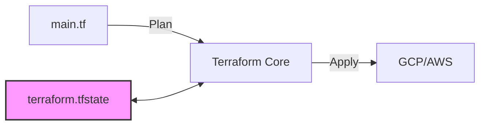
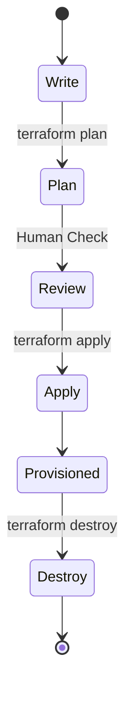

# The Ultimate Guide to Terraform & Infrastructure as Code (IaC)

## 1. What is Infrastructure as Code (IaC)?
Infrastructure as Code (IaC) is the practice of managing and provisioning computer data centers through machine-readable definition files, rather than physical hardware configuration or interactive configuration tools.

### Why use IaC?
*   **Consistency**: Eliminates "configuration drift" where servers become different over time.
*   **Speed**: Provisioning happens in minutes, not days.
*   **Version Control**: Infrastructure changes are committed to Git, allowing code reviews and rollbacks.
*   **Reusability**: Modules allow you to reuse code for different environments (Dev, Staging, Prod).

---

## 2. Introduction to Terraform
Terraform, by HashiCorp, is the industry-standard open-source tool for IaC. It allows you to define resources in human-readable configuration files that you can version, reuse, and share.

### Core Concepts

#### 🧱 Providers
Terraform relies on plugins called "Providers" to interact with cloud platforms (AWS, GCP, Azure), SaaS providers (GitHub, Datadog), and other APIs.
*   *Example*: The `google` provider talks to the Google Cloud API to create VM instances.

#### 📄 Resources
The fundamental building block. A resource describes a specific piece of infrastructure object.
```hcl
resource "google_compute_network" "vpc_network" {
  name = "terraform-network"
}
```

#### 📦 Modules
Modules are containers for multiple resources that are used together. A module can be thought of as a function in programming; it takes inputs (variables), does something (creates resources), and returns outputs.

#### 💾 State
Terraform stores the state of your managed infrastructure and configuration. This state is used by Terraform to map real world resources to your configuration, keep track of metadata, and improve performance for large infrastructures.



---

## 3. The Terraform Workflow
The standard workflow consists of three main steps:

1.  **Write**: Author infrastructure as code.
2.  **Plan**: Preview changes before applying. Terraform calculates the difference between the desired state (your code) and the current state (live infrastructure).
3.  **Apply**: Provision reproducible infrastructure.



---

## 4. How to Analyze Output: Reading the Plan
The `terraform plan` output is your safety net. You must understand how to read it.

### The Symbols
*   `+` **Create**: A new resource will be created.
*   `-` **Destroy**: An existing resource will be deleted (⚠️ Dangerous!).
*   `~` **Update**: An existing resource will be modified in-place.
*   `-/+` **Replace**: The resource must be destroyed and re-created (e.g., changing the Region of a VM).

### Example Output
```diff
Terraform will perform the following actions:

  # google_compute_instance.vm_instance will be created
  + resource "google_compute_instance" "vm_instance" {
      + can_ip_forward       = false
      + cpu_platform         = (known after apply)
      + current_status       = (known after apply)
      + deletion_protection  = false
      + guest_accelerator    = []
      + id                   = (known after apply)
      + instance_id          = (known after apply)
      + label_fingerprint    = (known after apply)
      + machine_type         = "e2-medium"
      + name                 = "terraform-instance"
      + project              = (known after apply)
      + self_link            = (known after apply)
      + tags_fingerprint     = (known after apply)
      + zone                 = "us-central1-a"

      + boot_disk {
          + auto_delete = true
          + device_name = (known after apply)
          + mode        = "READ_WRITE"
          + source      = (known after apply)

          + initialize_params {
              + image  = "debian-cloud/debian-11"
              + labels = (known after apply)
              + size   = (known after apply)
              + type   = (known after apply)
            }
        }

      + network_interface {
          + name               = (known after apply)
          + network            = "default"
          + network_ip         = (known after apply)
          + stack_type         = (known after apply)
          + subnetwork         = (known after apply)
          + subnetwork_project = (known after apply)
        }
    }

Plan: 1 to add, 0 to change, 0 to destroy.
```

### 🕵️ Analysis Tips
1.  **Check the Count**: Look at the bottom line: `Plan: X to add, Y to change, Z to destroy`. If you see "destroy" when you didn't expect it, **STOP**.
2.  **Known After Apply**: Some values (like IDs or IPs) don't exist yet. Terraform marks them as `(known after apply)`.
3.  **Drift Detection**: If you see a change (`~`) for a setting you didn't touch, someone might have manually changed the cloud resource (ClickOps). Terraform is trying to revert it back to your code.

---

## 5. Advanced Terraform Concepts

### 🔒 State Locking
When working in a team, two people running `terraform apply` at the same time can corrupt the state file. Remote backends (like GCS) support **locking**, which prevents this by creating a lock file during operations.

### 🏗️ Workspaces
Workspaces allow you to manage separate states for the same configuration. This is often used to manage multiple environments (dev, stage, prod) using the same code, though using separate directories/modules is often preferred for better isolation.

### 🧹 Dependency Management
Terraform builds a dependency graph of all resources. It automatically handles creation order (e.g., creating a VPC before a Subnet). You can force dependencies using `depends_on`.
