# 🗺️ Visualization: The Observability Module
### *Monitoring, Logging, and Tracing Strategies*

## 1. What is Observability? (The "Car Dashboard" Analogy)
*   **Monitoring**: "Is the engine light on?" (Yes/No).
*   **Observability**: "Why is the engine light on?" (Is it oil? Is it heat? Is it a sensor?).
*   **Goal**: To understand the internal state of the system just by looking at its external outputs (Logs, Metrics, Traces).

## 2. The 3 Pillars of Observability

### 🪵 Pillar 1: Logs (The "Diary")
Logs are a record of discrete events.
*   **Analogy**: A Captain's Log. "08:00 - Engine started." "08:05 - Hit an iceberg."
*   **Unstructured**: `User logged in`. (Hard for machines to read).
*   **Structured (JSON)**: `{"event": "login", "user": "alice", "status": "success"}`. (Machines love this).
*   **Tool**: **Loki**, **Elasticsearch**.

### 📈 Pillar 2: Metrics (The "Gauges")
Metrics are numerical data measured over time.
*   **Analogy**: The Speedometer or Tachometer. It doesn't tell you *where* you are going, but it tells you *how fast* you are going.
*   **Types**:
    *   **Counter**: Only goes up (e.g., Total Requests).
    *   **Gauge**: Goes up and down (e.g., CPU Usage, Memory).
    *   **Histogram**: Distribution (e.g., "95% of requests took less than 200ms").
*   **Tool**: **Prometheus**.

### 🕸️ Pillar 3: Tracing (The "Package Tracker")
Tracing follows a single request as it hops between services.
*   **Analogy**: When you order a package, you get a Tracking ID. You can see: "Left Warehouse" -> "Arrived at Hub" -> "Delivered".
*   **In Microservices**: A user clicks "Buy".
    1.  Frontend calls API.
    2.  API calls Inventory.
    3.  Inventory calls Database.
    *   *Tracing* shows you that the "Inventory" step took 5 seconds, identifying the bottleneck.
*   **Tool**: **Jaeger**, **Tempo**.

```mermaid
sequenceDiagram
    participant User
    participant Frontend
    participant Inventory
    participant DB
    
    User->>Frontend: Click Buy (TraceID: abc)
    Frontend->>Inventory: Check Stock (SpanID: 123, Parent: abc)
    Inventory->>DB: Select * (SpanID: 456, Parent: 123)
    DB-->>Inventory: Result (20ms)
    Inventory-->>Frontend: In Stock (5000ms!)
    Frontend-->>User: Confirmed
    Note over Inventory: 🐢 Bottleneck Found!
```

## 3. Observability Strategy

### 🔴 The RED Method (For Services)
Best for request-driven microservices (APIs).
1.  **Rate**: How many requests per second? (Traffic).
2.  **Errors**: How many requests failed? (Reliability).
3.  **Duration**: How long did they take? (Latency).

### 🛠️ The USE Method (For Resources)
Best for infrastructure (Nodes, Disks, CPUs).
1.  **Utilization**: How busy is the resource? (e.g., CPU at 90%).
2.  **Saturation**: How much work is queued/waiting? (e.g., Disk I/O queue).
3.  **Errors**: Are there hardware/system errors?

## 4. Service Mesh (The Future)
Tools like **Istio** or **Linkerd**.
*   **The Problem**: To get metrics/tracing, you usually have to write code in your app.
*   **The Solution**: A Service Mesh injects a tiny "Sidecar" proxy next to every container. This proxy intercepts all network traffic and automatically generates metrics and traces for you. You get observability for free!

## 5. Alerting Philosophy
*   **Page on Symptoms, not Causes**.
    *   *Bad Alert*: "CPU is high". (Maybe the machine is just working hard? Is the user affected?)
    *   *Good Alert*: "Error Rate is > 1%". (Users are definitely failing).
*   **Alert Fatigue**: If you get 100 alerts a day, you will ignore the one real emergency.

## 🎓 The Master Tool Reference

### 📊 Grafana (Visualization)
*   **Data Sources**: Prometheus, Loki, InfluxDB, CloudWatch.
*   **Key Feature**: "Variables". Create a dropdown menu to switch between "Prod" and "Staging" on the same dashboard.

### 🤖 Prometheus (Metrics)
*   **PromQL Cheat Sheet**:
    *   `up`: Is the instance reachable? (1=Yes, 0=No).
    *   `rate(http_requests_total[5m])`: Per-second rate averaged over 5 mins.
    *   `sum(rate(http_requests_total[5m])) by (service)`: Total rate per service.
    *   `histogram_quantile(0.95, rate(http_request_duration_seconds_bucket[5m]))`: The 95th percentile latency.

### 🔍 Loki (Logs)
*   **LogQL Cheat Sheet**:
    *   `{app="sentinel"}`: Select logs for app 'sentinel'.
    *   `{app="sentinel"} |= "error"`: Filter lines containing "error".
    *   `rate({app="sentinel"} |= "error" [5m])`: Calculate the rate of error logs per second! (Turning logs into metrics).
