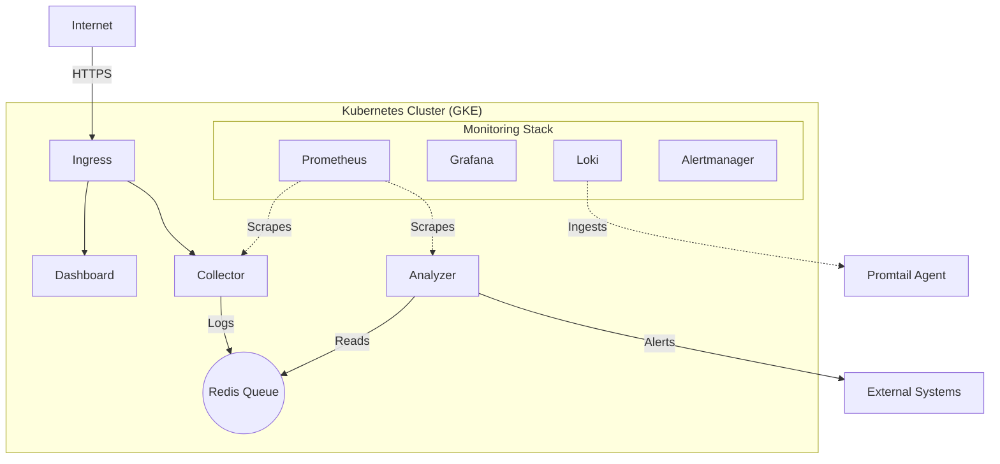

# 🛡️ Sentinel: Distributed Log Analysis System
### From Docker Basics to Advanced Cloud-Native Engineering

Welcome to the **Sentinel** project. This course is designed to take you from a developer with basic Docker knowledge to a **Cloud-Native Engineer** capable of deploying enterprise-grade applications using Terraform, Helm, and CI/CD pipelines.

## 📚 Comprehensive Guides
Before diving into the code, we recommend reading these deep-dive guides to build your theoretical foundation:

- **[Infrastructure as Code (Terraform)](./GUIDE_TERRAFORM.md)**: Learn about Providers, State, and Modules.
- **[Kubernetes Package Management (Helm)](./GUIDE_HELM.md)**: Understand Charts, Releases, and Templating.
- **[Google Cloud Platform (GCP)](./GUIDE_GCP_CLOUD.md)**: Master GKE, VPCs, and IAM Workload Identity.
- **[Observability (Prometheus & Grafana)](./GUIDE_PROMETHEUS_OBSERVABILITY.md)**: Explore Metrics, Logs, and Dashboards.
- **[Docker Guide](./GUIDE_DOCKER.md)** & **[Kubernetes Guide](./GUIDE_KUBERNETES.md)**: Core concepts refresher.

## 🗺️ Course Structure

The project is divided into 8 modules, progressing from local development to production cloud automation.

| Module | Topic | Key Concepts |
| :--- | :--- | :--- |
| **[Module 1](./module-01-docker)** | **Containerization** | Docker, Multi-stage Builds, Docker Compose |
| **[Module 2](./module-02-k8s-basics)** | **Orchestration** | Kubernetes Pods, Deployments, Services |
| **[Module 3](./module-03-config-state)** | **State & Config** | ConfigMaps, Secrets, StatefulSets, PVCs |
| **[Module 4](./module-04-scaling-networking)** | **Scale & Observe** | Ingress, Horizontal Pod Autoscaler (HPA) |
| **[Module 5](./module-05-enterprise-helm)** | **Enterprise** | Helm Charts, Network Policies, Security |
| **[Module 6](./module-06-terraform-gcp)** | **Infrastructure as Code** | Terraform, GKE, VPC, Remote State |
| **[Module 7](./module-07-helm-monitoring)** | **Advanced Observability** | Prometheus Operator, Loki, Grafana, ServiceMonitors |
| **[Module 8](./module-08-cicd-automation)** | **CI/CD & GitOps** | GitHub Actions, OPA Policies, Automated Deployment |

## 🚀 Getting Started

1.  **Clone the repository**.
2.  **Start with Module 1**: Go to the `module-01-docker` directory and follow the README.
3.  **Progress Sequentially**: Each module assumes you have completed the previous one.

## 🛠️ Prerequisites

- **Docker Desktop** (or Docker Engine)
- **Kubernetes Cluster** (Minikube, Kind, or Docker Desktop's built-in K8s)
- **kubectl** CLI tool
- **Helm** CLI tool
- **Terraform** (v1.5+)
- **Google Cloud SDK** (for Module 6+)
- **Python 3.11+** (Optional, for running scripts locally)

## 🧪 Testing
Each module contains a `test_module.ps1` file.
-   **What is a `.ps1` file?**: It stands for **PowerShell Script**. It's a powerful scripting language (like Bash but for Windows) used for automation.
-   **How to run it**:
    1.  Open PowerShell.
    2.  Navigate to the module directory.
    3.  Run `.\test_module.ps1`.
-   **What it does**: It automatically checks if your containers/pods are running correctly and if the API is responding.

> [!WARNING]
> **"Running scripts is disabled on this system" Error?**
> If you get a security error, run this command to allow scripts for the current session only:
> ```powershell
> Set-ExecutionPolicy -Scope Process -ExecutionPolicy Bypass
> ```
> Then try running `.\test_module.ps1` again.

## 🏗️ System Architecture (Final State)



## 👨‍💻 Author
Created by **Owner** (Assisted by AI).
