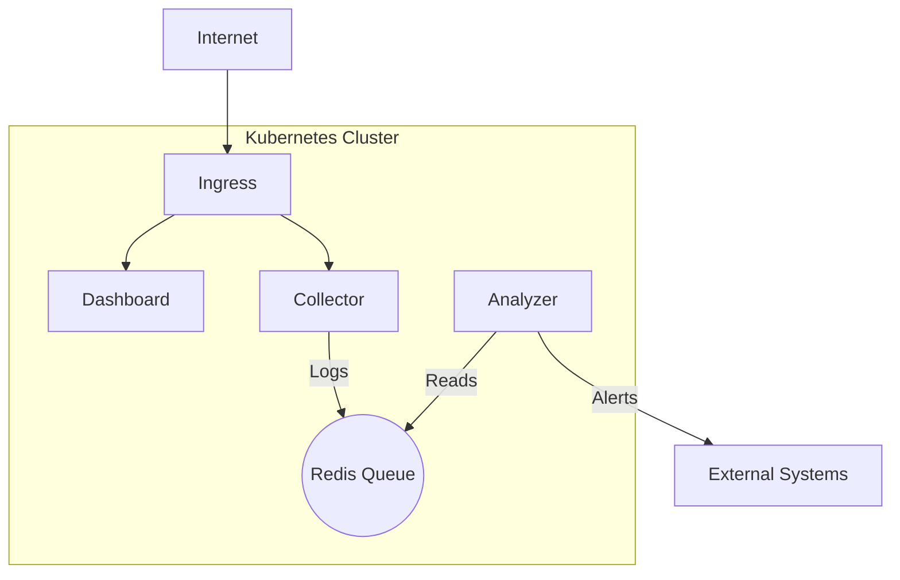

# 🛡️ Sentinel: Distributed Log Analysis System
### A 5-Module Masterclass in Docker & Kubernetes

Welcome to the **Sentinel** project. This course is designed to take you from a developer with basic Docker knowledge to a **Kubernetes Administrator** capable of deploying enterprise-grade applications.

## 📚 Course Structure

The project is divided into 5 modules, each building upon the previous one.

| Module | Topic | Key Concepts |
| :--- | :--- | :--- |
| **[Module 1](./module-01-docker)** | **Containerization** | Docker, Multi-stage Builds, Docker Compose |
| **[Module 2](./module-02-k8s-basics)** | **Orchestration** | Kubernetes Pods, Deployments, Services |
| **[Module 3](./module-03-config-state)** | **State & Config** | ConfigMaps, Secrets, StatefulSets, PVCs |
| **[Module 4](./module-04-scaling-networking)** | **Scale & Observe** | Ingress, Horizontal Pod Autoscaler (HPA) |
| **[Module 5](./module-05-enterprise-helm)** | **Enterprise** | Helm Charts, Network Policies, Security |

## 🚀 Getting Started

1.  **Clone the repository**.
2.  **Start with Module 1**: Go to the `module-01-docker` directory and follow the README.
3.  **Progress Sequentially**: Each module assumes you have completed the previous one.

## 🛠️ Prerequisites

- **Docker Desktop** (or Docker Engine)
- **Kubernetes Cluster** (Minikube, Kind, or Docker Desktop's built-in K8s)
- **kubectl** CLI tool
- **Helm** CLI tool
- **Python 3.11+** (Optional, for running scripts locally)

## 🧪 Testing
Each module contains a `test_module.ps1` file.
-   **What is a `.ps1` file?**: It stands for **PowerShell Script**. It's a powerful scripting language (like Bash but for Windows) used for automation.
-   **How to run it**:
    1.  Open PowerShell.
    2.  Navigate to the module directory.
    3.  Run `.\test_module.ps1`.
-   **What it does**: It automatically checks if your containers/pods are running correctly and if the API is responding.

## 🏗️ System Architecture (Final State)

## 👨‍💻 Author
Created by **Owner** (Assisted by AI).
