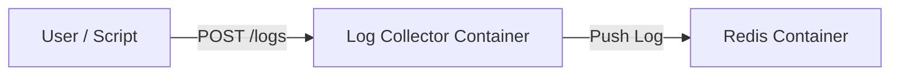
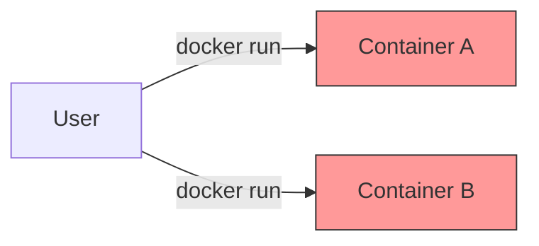
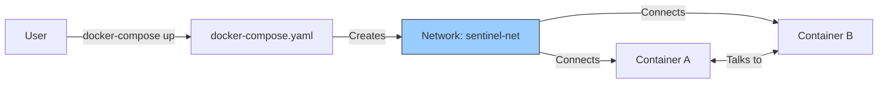

# Module 1: Containerization Foundations

## 🎯 Objective
In this first module, we will build the foundation of the **Sentinel Log Analysis System**. You will learn how to:
1.  Write a **Python FastAPI** microservice (`log-collector`).
2.  Create an optimized **Dockerfile** using **multi-stage builds**.
3.  Orchestrate multiple containers (Service + Database) using **Docker Compose**.

## 🏗️ Architecture (Module 1)
At this stage, our system is simple but functional. It runs entirely on your local machine.



- **Log Collector**: A REST API that accepts log entries.
- **Redis**: An in-memory data store acting as a temporary message queue.

## 🧠 Tech Stack Deep Dive

### ⚡ FastAPI
FastAPI is a modern, high-performance web framework for building APIs with Python.
- **Why we use it**: It's one of the fastest Python frameworks available (on par with NodeJS and Go). It automatically generates interactive API documentation (Swagger UI) based on your code.

### 🦄 Uvicorn
FastAPI is just the framework (the logic). It needs a **Server** to listen for network requests.
- **What is it**: Uvicorn is an ASGI (Asynchronous Server Gateway Interface) web server.
- **Key Features**:
    - **Speed**: Built on `uvloop`, making it lightning fast.
    - **Async**: Natively supports Python's `async/await` for handling thousands of concurrent connections.

### 🔴 Redis
Redis (Remote Dictionary Server) is an in-memory data structure store.
- **Role**: In our app, it acts as a **Message Queue**. The collector pushes logs, and the analyzer pops them.
- **Basics**:
    - **In-Memory**: Data is stored in RAM, making it sub-millisecond fast.
    - **Key-Value**: You store data like a Python dictionary (`SET key value`, `GET key`).
    - **Lists**: We use Redis Lists (`LPUSH`, `BRPOP`) to create a First-In-First-Out (FIFO) queue.
- **Key Features**:
    - **Persistence**: Can save RAM data to disk (RDB/AOF) so you don't lose it on restart.
    - **Pub/Sub**: Real-time messaging pattern.

### 🔄 Industry Alternatives
What else do companies use?

*   **Alternatives to FastAPI**:
    *   **Flask**: Older, simpler, but slower. Good for small apps.
    *   **Django**: "Batteries included". Heavy, good for standard websites.
    *   **Spring Boot (Java)**: The enterprise standard. Very robust, very verbose.
    *   **Express.js (Node)**: The standard for JavaScript backends.

*   **Alternatives to Redis (as a Queue)**:
    *   **RabbitMQ**: A dedicated message broker. More reliable delivery guarantees than Redis.
    *   **Apache Kafka**: For massive scale streaming (millions of events/sec). Hard to manage.
    *   **AWS SQS / Google PubSub**: Managed cloud queues. Zero maintenance.

*   **Alternatives to Docker**:
    *   **Podman**: A daemon-less alternative. More secure by default (rootless).
    *   **Containerd**: The runtime that actually runs containers (Docker uses this internally).

### 🆚 Docker vs Docker Compose
**Docker** is the engine. **Compose** is the conductor.

#### 1. Docker CLI (`docker run`)
You start containers one by one manually. They don't know about each other by default.


#### 2. Docker Compose (`docker-compose up`)
You define the entire system in a file. Compose starts everything and connects them via a network.


## 🛠️ Hands-On Guide

### 1. The Application Code (`log-collector/`)
We have a simple Python application in `main.py`. It uses the `FastAPI` framework.
- **Key Concept**: **12-Factor App Config**. Notice how we don't hardcode the Redis address? We use `os.getenv`. This allows us to change the database location without changing the code—crucial for containerization.

### 2. The Dockerfile (`log-collector/Dockerfile`)
Open the `Dockerfile`. We use a **Multi-Stage Build**.
- **Builder Stage**: Installs dependencies. It might have compilers (gcc) and other heavy tools.
- **Runtime Stage**: Copies *only* the installed libraries from the builder. It stays light and secure.
- **Security**: We create a non-root user (`appuser`). Running as root inside a container is a security risk!

### 3. Orchestration with Docker Compose (`docker-compose.yaml`)
Instead of running `docker run` commands manually, we define our infrastructure as code.
- **Services**: We define `log-collector` and `redis-queue`.
- **Networking (`sentinel-net`)**:
    - **What is it?**: We defined a custom bridge network called `sentinel-net`. Think of it as a private Wi-Fi for your containers.
    - **Why?**: It enables **Service Discovery**. The `log-collector` can simply say "Connect to `redis-queue`", and Docker magically routes the traffic to the right container IP.

## 🚀 Running the Project

1.  **Build and Start**:
    ```bash
    docker-compose up --build
    ```
    *You will see logs indicating the build process, followed by the services starting up.*

2.  **Test the API** (Open a new terminal):
    ```bash
    # Send a test log
    curl -X POST http://localhost:8000/logs \
      -H "Content-Type: application/json" \
      -d '{"service_name": "payment-service", "level": "ERROR", "message": "Transaction failed"}'
    ```

3.  **Verify in Redis**:
    You can exec into the redis container to check the data:
    ```bash
    docker-compose exec redis-queue redis-cli lrange logs_queue 0 -1
    ```

4.  **Shutdown**:
    ```bash
    docker-compose down
    ```

## 🧠 Pro Tips
> **Why Multi-stage?**
> A standard Python image might be 1GB. A slim, multi-stage image can be <100MB. This means faster deployments, lower storage costs, and smaller attack surface.

> **Why Docker Compose?**
> It mimics a production environment (microservices talking to each other) on your laptop. It's the standard for local development.

## ⚡ Module Cheatsheet
| Command | Description |
| :--- | :--- |
| `docker compose up --build` | Build images and start all services in the background (or foreground without `-d`). |
| `docker compose down` | Stop and remove containers, networks, and volumes defined in `docker-compose.yaml`. |
| `docker compose ps` | List the status of services managed by Compose. |
| `docker compose exec <service> <cmd>` | Execute a command inside a running service container (e.g., `redis-cli`). |
| `docker build -t <name> .` | Build a Docker image from a Dockerfile in the current directory. |

---
**Next Step:** In Module 2, we will take these containers and deploy them to a **Kubernetes Cluster**, learning about Pods and Deployments.
