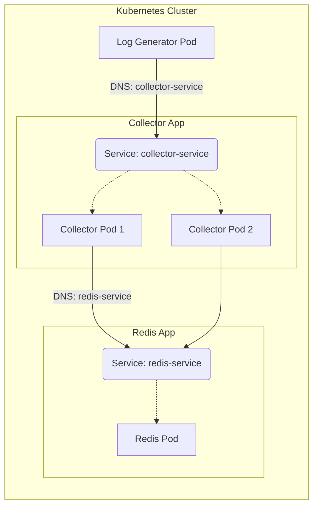

# Module 2: Kubernetes Orchestration Basics

## 🎯 Objective
In this module, we graduate from Docker Compose to **Kubernetes**. You will learn how to:
1.  Translate Docker concepts to **Kubernetes Manifests**.
2.  Deploy **Stateless Applications** (Log Collector) using `Deployments`.
3.  Enable internal communication using **Services** and **Cluster DNS**.
4.  Simulate traffic using a custom `log-generator`.

## 🏗️ Architecture (Module 2)
We are now running inside a Kubernetes Cluster (like Minikube or Kind).



## 🔑 Key Concepts

### 1. Pods vs Containers
In Docker, you run a container. In K8s, you run a **Pod**. A Pod is a wrapper around one or more containers. It's the smallest unit of deployment.

### 2. Deployments (`collector-deployment.yaml`)
We don't create Pods directly. We use a **Deployment**.
- **Replicas**: We set `replicas: 2`. K8s ensures 2 copies are always running. If one crashes, K8s restarts it.
- **Selector**: How the Deployment finds its Pods (using labels).

### 3. YAML Anatomy: Reading the Matrix 🧬
Kubernetes manifests might look scary, but they all follow the same logic.
*   **`apiVersion`**: *Which department do I talk to?* (e.g., `apps/v1` for Deployments, `v1` for Pods).
*   **`kind`**: *What form am I filling out?* (Pod, Service, Deployment).
*   **`metadata`**: *Who am I?* (Name, Labels, Namespace).
    *   **Labels**: Sticky notes you put on objects so you can find them later (e.g., `app: sentinel`).
*   **`spec`**: *What do I want?* (The Desired State).
    *   This is the most important part. It changes based on the `kind`.
    *   For a Pod, it asks for `containers`.
    *   For a Service, it asks for `ports`.

### 3. Services (`collector-service.yaml`)
Pods have dynamic IPs. If a Pod restarts, it gets a new IP. A **Service** gives us a stable IP and DNS name.
- **ClusterIP**: The default type. Only accessible *inside* the cluster.
- **DNS**: The collector can reach Redis just by using the hostname `redis-service`.

## 🛠️ Hands-On Guide

### Prerequisites
- A running K8s cluster (Minikube, Kind, or Docker Desktop).
- `kubectl` installed and configured.

### 1. Build Images
Since we are using a local cluster, we need to build the images so the cluster can see them.
*(If using Minikube, run `eval $(minikube docker-env)` first)*

```bash
# Build Collector (from Module 1 directory)
docker build -t sentinel-collector:v1 ../module-01-docker/log-collector

# Build Generator
docker build -t sentinel-generator:v1 ./log-generator
```

### 2. Deploy Redis
```bash
kubectl apply -f k8s/redis.yaml
```
Verify it's running:
```bash
kubectl get pods -l component=queue
```

### 3. Deploy Log Collector
```bash
kubectl apply -f k8s/collector-deployment.yaml
kubectl apply -f k8s/collector-service.yaml
```
Check the replicas:
```bash
kubectl get deployments
# You should see 2/2 ready
```

### 4. Run the Load Generator
We will run the generator as a temporary pod to simulate traffic.
```bash
kubectl run generator --image=sentinel-generator:v1 --env="COLLECTOR_URL=http://collector-service/logs"
```

### 5. Verify Operations
Check the logs of the generator to see if it's sending data:
```bash
kubectl logs generator -f
```

Check the logs of the collector to see if it's receiving data:
```bash
# Get one of the pod names
kubectl get pods -l component=collector
# Check logs
kubectl logs <pod-name>
```

## 🧹 Cleanup
```bash
kubectl delete -f k8s/
kubectl delete pod generator
```

## ⚡ Module Cheatsheet
| Command | Description |
| :--- | :--- |
| `kubectl apply -f <file.yaml>` | Create or update resources defined in a YAML file. |
| `kubectl get pods` | List all pods in the current namespace. |
| `kubectl get deployments` | List deployments and show desired vs current replicas. |
| `kubectl get services` | List services and show ClusterIPs/Ports. |
| `kubectl logs <pod_name>` | Print the logs of a container in a pod. Add `-f` to stream. |
| `kubectl run <name> --image=` | Quickly start a single pod (useful for debugging/generators). |
| `kubectl delete -f <file.yaml>` | Delete resources defined in the file. |

### 💡 Pro Tip: Minikube Docker Env
If you can't find your image, run this in your terminal to point your shell to Minikube's Docker daemon:
`eval $(minikube docker-env)` (Linux/Mac) or `minikube -p minikube docker-env | Invoke-Expression` (PowerShell).

---
**Next Step:** In Module 3, we will tackle **Persistence** (saving Redis data so it survives restarts) and **Configuration** (managing environment variables properly).
