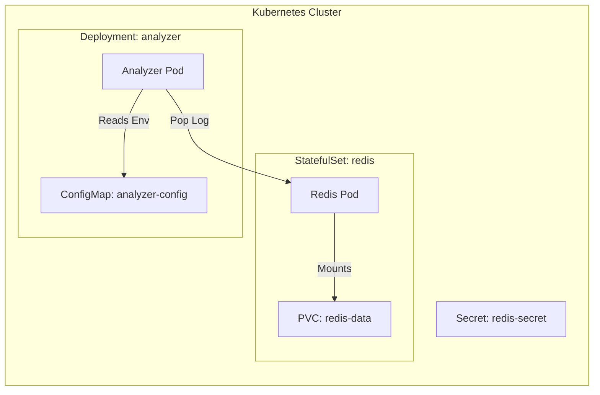

# Module 3: Configuration, Persistence & State

## 🎯 Objective
In this module, we make our application "Production Ready" by handling state and configuration properly. You will learn:
1.  **ConfigMaps**: Decoupling configuration from code.
2.  **Secrets**: Managing sensitive data securely.
3.  **StatefulSets & PVCs**: Persisting database data so it survives pod restarts.

## 🏗️ Architecture (Module 3)



## 🔑 Key Concepts

### 1. ConfigMaps (`configmap.yaml`)
Hardcoding settings (like `ALERT_KEYWORDS`) in your code or Dockerfile is bad practice.
- **Why?** You have to rebuild the image to change a setting.
- **Solution**: Inject them as Environment Variables from a ConfigMap.

### 2. Secrets (`secret.yaml`)
Similar to ConfigMaps, but for sensitive data (passwords, API keys). K8s stores them base64 encoded (and encrypted at rest in cloud providers).

### 3. StatefulSets vs Deployments (`redis-statefulset.yaml`)
- **Deployment**: Great for stateless apps (like our API). If a pod dies, any data inside it is lost.
- **StatefulSet**: Designed for databases.
    - **Stable Identity**: Pods are named `redis-0`, `redis-1` (not random hashes).
    - **PersistentVolumeClaim (PVC)**: Automatically requests storage. Even if the pod moves to another node, the storage follows it.

### 4. Deep Dive: The `kubectl` CLI 🕹️
`kubectl` is your cockpit. It's just a REST Client that talks to the Kubernetes API Server.
*   **The Config**: It looks for a file at `~/.kube/config` (or `%USERPROFILE%\.kube\config`) to know which cluster to talk to.
*   **The Verbs**:
    *   **`get`**: "Show me the list" (SQL: SELECT *).
    *   **`describe`**: "Show me the details and events" (Crucial for debugging).
    *   **`logs`**: "Print stdout/stderr".
    *   **`exec`**: "SSH into the container".
    *   **`apply`**: "Make the cluster look like this file" (Upsert).
*   **Output Formats**:
    *   `kubectl get pod -o wide`: Show IPs and Nodes.
    *   `kubectl get pod -o yaml`: Show the full raw configuration (useful to see what K8s added).

## 🛠️ Hands-On Guide

### 1. Build the Analyzer Image
```bash
docker build -t sentinel-analyzer:v1 ./analyzer-service
```

### 2. Apply Configuration & Secrets
```bash
kubectl apply -f k8s/configmap.yaml
kubectl apply -f k8s/secret.yaml
```

### 3. Deploy Redis (StatefulSet)
First, delete the old Redis deployment to avoid conflicts:
```bash
kubectl delete deployment redis
kubectl delete service redis-service
```
Now deploy the StatefulSet:
```bash
kubectl apply -f k8s/redis-statefulset.yaml
```
*Note: It might take a moment for the PVC to be bound.*

### 4. Deploy the Analyzer
```bash
kubectl apply -f k8s/analyzer-deployment.yaml
```

### 5. Verify Persistence
1.  **Generate Data**: Run the generator (from Module 2) for a few seconds.
2.  **Kill Redis**: Delete the redis pod (`kubectl delete pod redis-0`). K8s will recreate it.
3.  **Check Data**: Exec into the new pod and check if the queue still has data.
    ```bash
    kubectl exec -it redis-0 -- redis-cli llen logs_queue
    ```
    *If we used a Deployment, this would be 0. With StatefulSet + PVC, the data remains!*

### 6. Verify Configuration Update
1.  Edit `k8s/configmap.yaml` and add `INFO` to `ALERT_KEYWORDS`.
2.  Apply the change: `kubectl apply -f k8s/configmap.yaml`.
3.  Restart the analyzer to pick up changes:
    ```bash
    kubectl rollout restart deployment analyzer
    ```
4.  Check logs: The analyzer should now be alerting on INFO logs too.

## 🧹 Cleanup
```bash
kubectl delete -f k8s/
```

## ⚡ Module Cheatsheet
| Command | Description |
| :--- | :--- |
| `kubectl get cm` / `kubectl get secrets` | List ConfigMaps and Secrets. |
| `kubectl get statefulsets` | List StatefulSets (look for `redis`). |
| `kubectl get pvc` | List PersistentVolumeClaims and their status (Bound/Pending). |
| `kubectl exec -it <pod> -- <cmd>` | Interactive shell/command inside a pod (e.g., checking Redis data). |
| `kubectl rollout restart deployment <name>` | Restart pods to pick up new ConfigMap/Secret values. |

### 💡 Pro Tip: Secrets
Kubernetes Secrets are **base64 encoded**, not encrypted!
To encode a value: `echo -n "password" | base64`
To decode: `echo "cGFzc3dvcmQ=" | base64 --decode`

---
**Next Step:** In Module 4, we will expose our application to the outside world using **Ingress** and learn how to **Scale** automatically.
