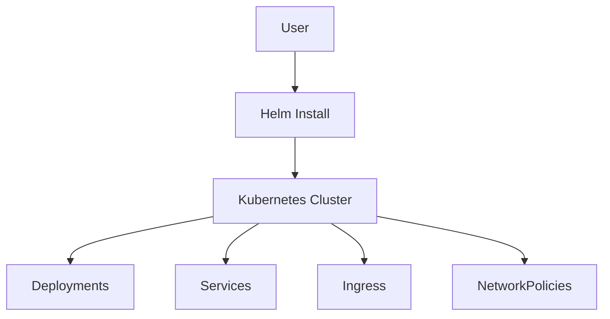

# Module 5: Enterprise Packaging & Security

## 🎯 Objective
In this final module, we will adopt Enterprise practices. You will learn:
1.  **Helm**: The Package Manager for Kubernetes. Templating our manifests for reusability.
2.  **Network Policies**: Implementing "Zero Trust" security inside the cluster.

## 🏗️ Architecture (Module 5)
We are deploying the exact same architecture, but now it's defined as a single **Chart**.



## 🔑 Key Concepts

### 1. Helm Charts (`sentinel-chart/`)
Instead of managing 10 YAML files, we manage one `values.yaml`.
- **Templates**: Files with `{{ .Values.key }}` placeholders.
- **Release**: An instance of a chart running in a cluster.

### 3. Deep Dive: The Art of Helm Templating 🎨
Helm uses the **Go Templating Language**. It's powerful but has a learning curve. To master it, you need to understand:

#### A. The Objects
*   **`.Values`**: Accesses variables from `values.yaml`. (e.g., `.Values.image.tag`).
*   **`.Release`**: Info about the deployment (e.g., `.Release.Name`, `.Release.Namespace`).
*   **`.Chart`**: Info from `Chart.yaml` (e.g., `.Chart.Version`).

#### B. The Actions (`{{ }}`)
*   **Substitution**: `image: {{ .Values.image }}` -> Replaces with the value.
*   **Pipelines (`|`)**: `{{ .Values.foo | quote }}` -> Wraps the value in quotes.
    *   `default "latest"`: Use "latest" if the value is missing.
    *   `upper`: Convert to UPPERCASE.

#### C. Logic & Flow Control
*   **Conditionals (`if/else`)**:
    ```yaml
    {{- if .Values.ingress.enabled }}
    kind: Ingress
    {{- end }}
    ```
    *Note the `-` inside `{{-`. It trims whitespace/newlines, which is crucial in YAML.*
*   **Loops (`range`)**:
    ```yaml
    env:
    {{- range $key, $val := .Values.envVars }}
      - name: {{ $key }}
        value: {{ $val | quote }}
    {{- end }}
    ```

#### D. What to Learn?
To build complex charts, study:
1.  **Go Template Syntax**: The underlying logic engine.
2.  **YAML Indentation**: Helm's `indent` and `nindent` functions are vital because YAML is whitespace-sensitive.
3.  **Helper Templates (`_helpers.tpl`)**: Defining reusable snippets (like a standard label block) to avoid copy-pasting code across 10 files.

### 2. Network Policies (`security/network-policy.yaml`)
By default, all pods can talk to all pods. This is insecure.
- **Our Policy**: Only `collector`, `analyzer`, and `dashboard` can talk to `redis`. If a hacker compromises a different pod, they cannot access our database.

## 🛠️ Hands-On Guide

### Prerequisites
- **Helm**: Installed (`brew install helm` or `choco install kubernetes-helm`).

### 1. Inspect the Chart
Look at `sentinel-chart/values.yaml`. This is the interface for your users. They can change replica counts, images, or keywords without seeing a single line of Kubernetes YAML.

### 2. Install the Chart
```bash
# Install with the release name "my-sentinel"
helm install my-sentinel ./sentinel-chart
```

### 3. Verify Deployment
```bash
kubectl get all -l app=my-sentinel
```
You should see all your pods, services, and statefulsets created with the prefix `my-sentinel-`.

### 4. Upgrade the Release
Let's say we want to scale the collector to 5 replicas.
```bash
helm upgrade my-sentinel ./sentinel-chart --set collector.replicaCount=5
```
Check the pods again. Helm handles the update!

### 5. Apply Security Policy
(Note: Your CNI plugin must support Network Policies. Minikube with Calico supports this).
```bash
kubectl apply -f security/network-policy.yaml
```

### 6. Test Security
Run a "hacker" pod that is NOT allowed to access Redis.
```bash
kubectl run hacker --image=alpine -- sh -c "apk add redis && sleep 3600"
```
Exec into it and try to connect:
```bash
kubectl exec -it hacker -- redis-cli -h my-sentinel-redis
```
*It should timeout or fail.*

## 🎓 Course Completion
Congratulations! You have built a complete, scalable, and secure Distributed Log Analysis System on Kubernetes.

### What you learned:
1.  **Docker**: Containerizing Python apps.
2.  **K8s Basics**: Pods, Deployments, Services.
3.  **State**: ConfigMaps, Secrets, StatefulSets.
4.  **Scaling**: Ingress, HPA.
5.  **Enterprise**: Helm, Network Policies.

## 🧹 Cleanup
```bash
helm uninstall my-sentinel
kubectl delete -f security/network-policy.yaml
kubectl delete pod hacker
```

## ⚡ Module Cheatsheet
| Command | Description |
| :--- | :--- |
| `helm install <name> <path>` | Install a Helm chart with a release name. |
| `helm upgrade <name> <path>` | Upgrade an existing release with new chart changes. |
| `helm uninstall <name>` | Delete a release and all its k8s resources. |
| `helm list` | List all deployed Helm releases in the namespace. |
| `helm template <path>` | Render the YAML templates locally (dry-run) without installing. |
| `kubectl get networkpolicy` | List active network security policies. |
| `kubectl get all` | List almost every resource in the namespace (Pods, Services, Deployments, etc.). |

### 💡 Pro Tip: Creating Charts
Don't write charts from scratch! Run `helm create my-chart` to generate a boilerplate structure with best practices.

