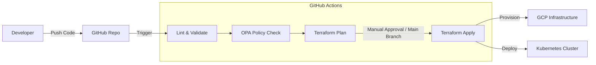

# Module 08: CI/CD & Automation

## 🎯 Objective
Implement a robust CI/CD pipeline using GitHub Actions to automate Terraform provisioning and Helm deployments. This module introduces "GitOps" principles and automated policy enforcement.

## 🔄 CI/CD Pipeline Flow



## 🔑 Key Concepts Explained

### 1. GitOps
GitOps is the practice of using Git as the "Single Source of Truth" for your infrastructure and applications.
*   **Concept**: If you want to change something in production, you don't run a command manually. You make a Pull Request (PR) to the Git repo.
*   **Automation**: When the PR is merged, an automated system (like GitHub Actions or ArgoCD) applies the change to the cluster.

### 2. Policy as Code (OPA)
Just because you *can* create a resource doesn't mean you *should*.
*   **Open Policy Agent (OPA)**: A general-purpose policy engine.
*   **Example Policy**: "All S3 buckets must be private" or "All Docker images must come from our trusted registry".
*   **Shift Left**: We run these checks in the CI pipeline (the "Lint" stage) so bad configuration is caught *before* it ever reaches production.

### 3. Linting & Static Analysis
*   **Terraform Fmt**: Checks if your code is formatted correctly (indentation, spacing).
*   **Helm Lint**: Checks if your Helm templates are valid YAML.
*   **Kube-Linter**: Looks for security holes in your Kubernetes manifests (e.g., running containers as root).

## 📂 Structure
```
module-08-cicd-automation/
├── workflows/
│   └── ci-cd.yaml      # The GitHub Actions pipeline definition
├── policies/
│   └── allowed-repos.rego # OPA policy: Restrict image registries
└── README.md           # This guide
```

## 🚀 Setup Guide

### 1. Configure Secrets
GitHub Actions needs permission to touch your cloud resources. Go to **Settings > Secrets and variables > Actions** in your repo.
*   `GCP_CREDENTIALS_JSON`: The full JSON key of your Terraform Service Account.
*   `TF_API_TOKEN`: (Optional) If you are using Terraform Cloud.

### 2. The Workflow File (`ci-cd.yaml`)
This file tells GitHub what to do.
*   **Triggers**: It runs on `push` to `main` or `pull_request`.
*   **Jobs**:
    *   `terraform`: Runs `init`, `fmt`, `plan`, and `apply`.
    *   `helm-lint`: Checks your charts.

### 3. Running the Pipeline
1.  Commit your code and push to a new branch.
2.  Open a Pull Request.
3.  Watch the "Checks" tab. You will see `Terraform Plan` running.
4.  Merge the PR.
5.  Watch the Action run `Terraform Apply` to deploy the changes.
